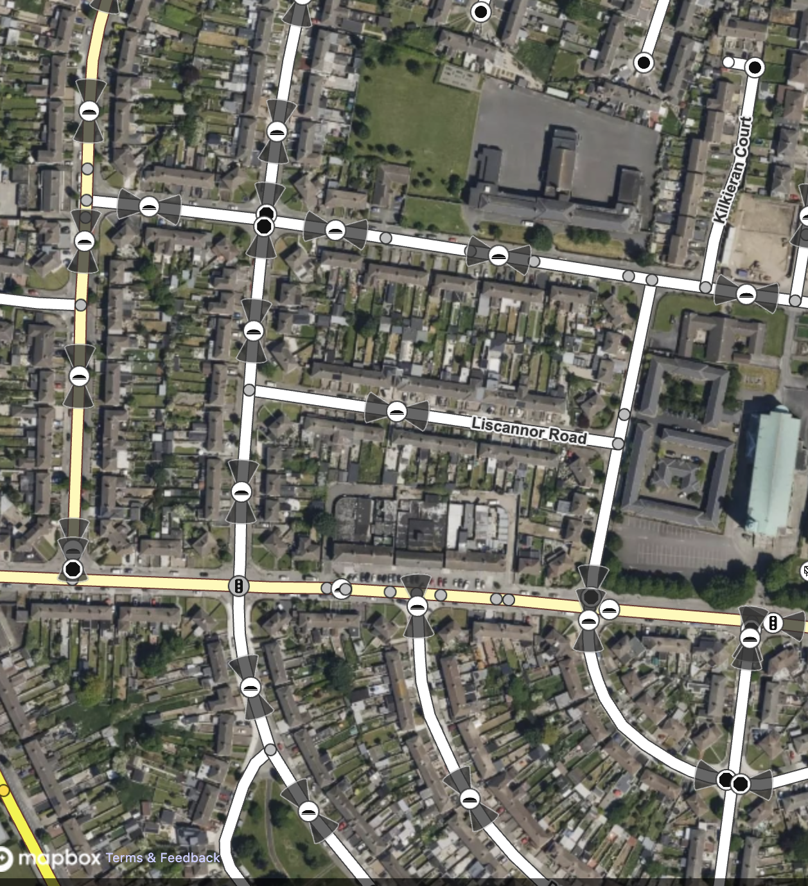
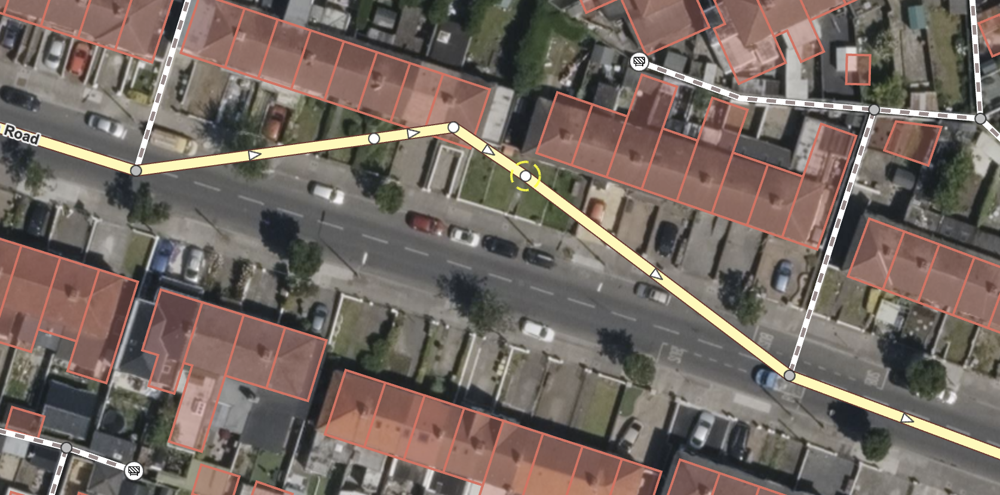

Here's the improved version with better formatting, clearer structure, and fixed typos:

---

# [Map Editor](https://linear.app/traffic-jam/issue/TRA-27/investigation-investigate-how-we-can-edit-maps-and-pass-them-back-as)

## Frame the Problem

We are building a traffic simulation service and need the ability to edit maps to simulate different scenarios.

---

## What outcome are we looking for?

**Minimally:** An editable map that can be passed back to the server.

**Ideally:** A way to edit the map that is also visually pleasing.

---

## Proposed Solutions

### 1. Rapid v2.5

Rapid v2.5 is the current OSM editor, built by Facebook and fully open source. The editor is powerful and fast.

The main issue I've encountered is that it's not exactly pretty to look at. The map is a 2D top-down view, and when you add links, the background tiles do not update at all. You simply add a link through a forest or park, and the underlying tiles remain unchanged. While the user can clearly see the new link, the visual disconnect looks a bit odd.

From a usability perspective this shouldn't be a major problem, but it does affect the overall polish.

We could fork the Rapid editor and add features to improve its appearance.

**Screenshots:**

In the second screenshot, you can see that the tiles haven't updated, which looks a bit weird.

**Ideas for improvement:**

- **a.** Newly added links should be highlighted so users can clearly differentiate between existing links and ones they've added. This is already an option in Rapid—we just need to enable it.
- **b.** We should disable many of the default icons and shapes; the map is too overwhelming at first glance.
- **c.** _(Optional)_ We could explore ways to make background tiles update when the user adds, removes, or modifies links. One approach would be to ditch the background tiles entirely and instead generate the background dynamically from OSM data, adapting to our changes in real time.

### 2. DIY Editor

Build a custom editor from scratch. I do not recommend this approach, but it remains an option.

---

## Recommendation

**Rapid v2.5** is a solid foundation to build on. Since it's entirely written in TypeScript and is open source, forking and improving it should be straightforward. At minimum, it gives us a strong base to work from.

---

## Tasks

- [ ] Fork Rapid and integrate it into the frontend project under an `/editor` route. This will position us to improve it in the future as needed.
